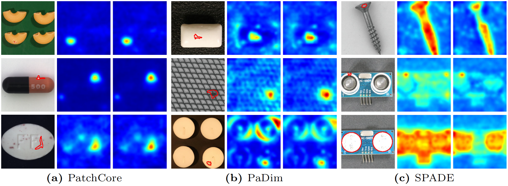
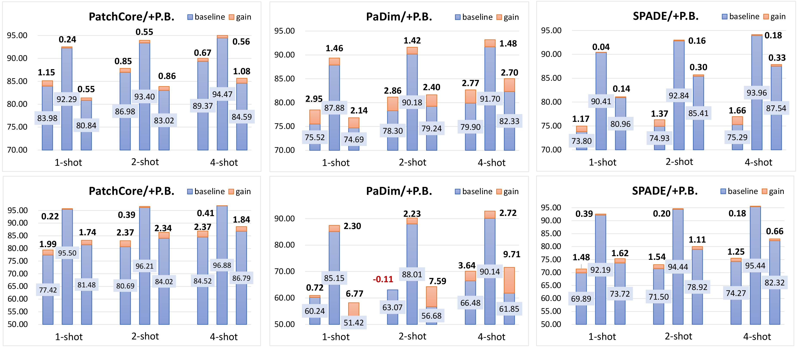

# PuzzleBoost: Jigsaw Puzzle Reassembly for Boosting Anomaly Detection

We propose a novel feature adaptation method named PuzzleBoost, to address the transferring problem between two domains by introducing a pretext task of solving image jigsaw puzzles.
PuzzleBoost has a concise structure that facilitates its seamless integration into existing feature embedding-based approaches.

Full-shot:

Few-shot:

## Requirements
This project was built under Python 3.8, with package versions are as follows:  
torch == 1.13.1+cu117  
torchvision == 0.14.1+cu117  
faiss-gpu == 1.7.2  
click == 8.1.7  
numpy == 1.24.3  
opencv-python == 4.8.0.74  
pillow == 9.5.0

The experimental data was obtained by running the code on a single V100 GPU.

## Ackonwledgement
Our method is committed to improving the effectiveness of existingfeature embedding-based methods, so our code is modified basedon the code of other authors.

We are heavily borrowed codes from [PatchCore](https://github.com/amazon-science/patchcore-inspection), [PaDiM](https://github.com/xiahaifeng1995/PaDiM-Anomaly-Detection-Localization-master) and [SPADE](https://github.com/byungjae89/SPADE-pytorch)